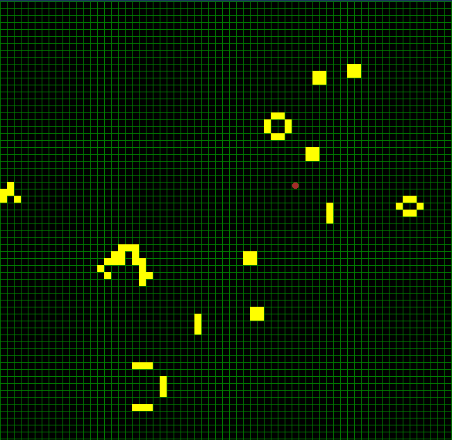

# ConwayLife
The Game of Life, also known simply as Life, is a cellular automaton devised by the British mathematician John Horton Conway in 1970.
### pre requirements: 
> Microsoft.NETCore.App 3.1.0, Microsoft.WindowsDesktop.App 3.1.0
### build && run
> In root directory (after cloning repo execute cd ConwayLife inside command interpreter) then execute 'dotnet run --project src/ConwayLife.App/ConwayLife.App.csproj' or run start.cmd
### Keys:
> [W/A/S/D] for shift on map, mouse wheel for zoom, key 'Z' for going to previous generation, key 'X' for going to next generation
### preview

